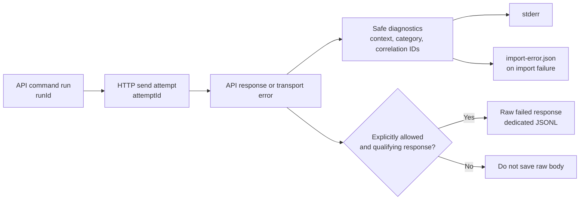
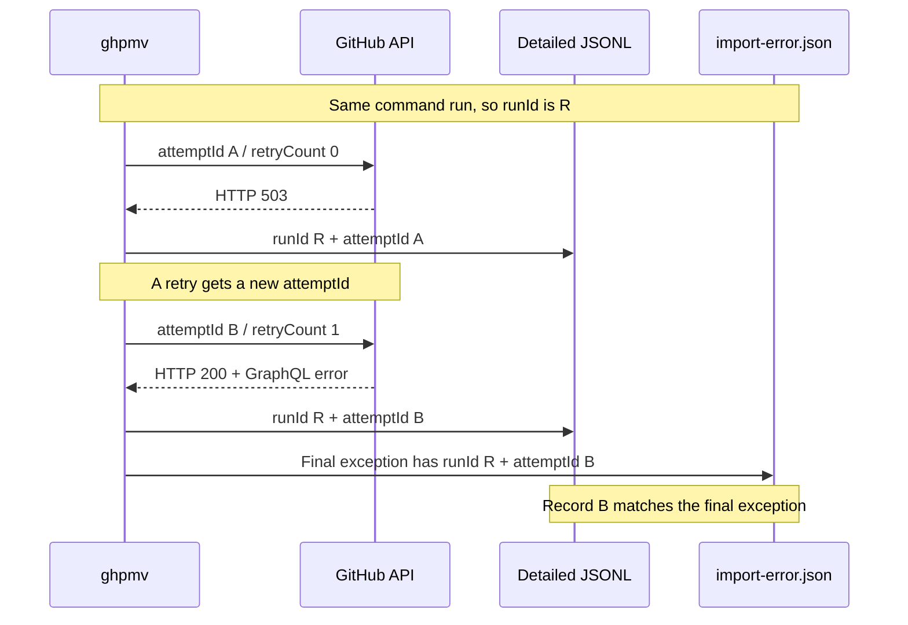

# Logging and diagnostics

[README](../README.md) | [Migration scope](MIGRATION_SCOPE.md) | [Manual test plan](MANUAL_TEST_PLAN.md)

Use `ghpmv` logs to identify which migration failed, what failed, and which API response to inspect if needed.

> **Safe API diagnostics are not anonymized logs.**
> Normal diagnostics retain Organization, Repository, Project, and element names and known IDs. Review them before sharing. Raw API responses require even more careful handling.

## Where to start

| Question | Where to look |
| --- | --- |
| Which Organization, Project, or element failed? | `source` / `target` / `element` on stderr; `context` in the report |
| What stage, HTTP status, and error category? | `stage`, `operation`, and safe diagnostics in `exceptions[]` |
| Was it the original failure or a cleanup failure? | `exceptions[]` versus `cleanupFailures[]` |
| Do I need the raw API response? | The dedicated JSONL created with explicit permission; it is not in the normal report |
| How do I match a report to JSONL? | Use **the exception's own `runId` + `attemptId`** |
| Is it safe to rerun? | See [Recovery and resume](#recovery-and-resume); in particular, do not automatically resend an ambiguous creation |

- [Outputs and retention](#outputs-and-retention)
- [Failure context and normal reports](#failure-context-and-normal-reports)
- [Capturing raw API responses explicitly](#capturing-raw-api-responses-explicitly)
- [Correlating diagnostics](#correlating-diagnostics)
- [Capture states](#capture-states)
- [Redaction and size limits](#redaction-and-size-limits)
- [Recovery and resume](#recovery-and-resume)
- [Implementation and tests](#implementation-and-tests)

## Outputs and retention

**Diagnostic reports, resume-state files, and migration data serve different purposes.**

| Output | Location and creation condition | Purpose | Retention and cautions |
| --- | --- | --- | --- |
| stdout | Standard output of each command | Results such as URLs, `result=...`, and counts | Preserves the existing machine-readable format; never mixes in raw response bodies for diagnostics |
| stderr | Standard error of each command | Progress, warnings, errors, and output locations | Shell or CI retention is managed separately. Normal API diagnostics are redacted but contain business identifiers |
| `import-error.json` | Import snapshot directory, on failure | Cause, affected target, correlation IDs, and cleanup failures | Replaced by a later failure in the same directory; a successful run with no warnings or unresolved state deletes the previous report |
| `project-import-log.json` | Import snapshot directory | Creation and resume state for Projects, Fields, etc. | Not solely diagnostic; retain for resumption and do not casually delete or edit |
| `import-log.json` | Import snapshot directory | Resume state for Items, Status Updates, etc. | May contain business data needed for resumption as well as error fields |
| `ghpmv-sensitive-api-<unique-id>.jsonl` | **Working directory at execution time**, when explicitly allowed and a qualifying response exists | Raw failed API responses | Separate file per run; no automatic deletion or encryption. Review before sharing |
| `snapshot.json` / mapping CSV | Export destination or user-specified location | Migration data and mappings | Not logs; may contain bodies and values, so do not assume the protections of diagnostic logs |
| Verify JSON report | Location specified by `--report-json` | Differences in migration results | Different format from `import-error.json`; differences may contain business data |

An earlier `import-error.json` may remain after a skip or a run that finishes with warnings. **Do not infer that this run failed merely because the file exists; check its `runId` and timestamp.** If writing the report fails, retain the stderr error as well.

Command-line syntax and option-validation errors occur before import starts and do not create a report. A failure before the snapshot is loaded records only the known target and stage.



## Failure context and normal reports

### Identifying the affected target

`context` contains identifiers available at the point of failure; it is not inferred from the last progress message. Known identifiers are recorded in the report, exceptions, progress entries, and cleanup failures.

| Field | Description |
| --- | --- |
| `context.source` / `context.target` | Owner, owner type, API host, and Project number, title, and known ID |
| `context.element` | Kind, name, type, and known ID of a Field, View, Workflow, etc. |
| `context.item` | Parent Item for operations such as updating an Item's Field; Issues and PRs are identified by Repository and number |
| `context.operation` | Migration or API operation; retains names such as `preflight-linked-team` even when a Query fails |
| `context.stage` | Stage such as `preflight`, `importing-project`, or `importing-items` |
| `exceptions[].operationKind` | `query` / `mutation`, REST operation kind, etc.; distinct from the migration operation name |

New exports record the source in the optional `source` property of `snapshot.json`. Older snapshots still load, but missing owner, number, and host information is not inferred from mappings. `--project-title` changes the intended target title, not the recorded source title.

Target numbers and IDs are recorded once resolved. An explicitly requested number is also retained in `requestedTargetProjectNumber`. An existing Project's title is omitted if it has not yet been read; target IDs are not invented for Fields or Items that have not been created.

Issues and PRs are identified by Repository and number rather than content title; Drafts by title; and Status Updates by snapshot order rather than body. Items also show the target Repository and known IDs. If an individual failure in a bulk operation cannot be identified, **batch-level** information is retained for collaborators or Issue Fields.

### stderr example

This example shows an ambiguous failure while creating an Iteration Field from a new snapshot. Raw response capture is disabled in normal mode.

```text
error: Mutation result is ambiguous. Automatic retry was stopped to avoid duplicates.
source: source-org / Project 12 "Demo project" @ api.github.com
target: target-org / Project 34 "Demo project" @ api.github.com [ID PVT_example]
element: Field "Demo sprint" (ITERATION)
operation: createProjectV2Field
stage: importing-project
httpStatus: 200 OK
errorCode: UNPROCESSABLE
requestId: ABCD:1234:5678:9ABC:01234567
runId: 11111111111141118111111111111111
attemptId: 22222222222242228222222222222222
sensitiveResponseCapture: disabled
sensitiveDiagnosticsState: disabled
Inspect the target state, then rerun with the same snapshot and import log.
```

**HTTP 200 does not necessarily mean the operation succeeded.** GraphQL may return errors. Even when the creation-result key is present, a null value can leave it unclear whether the resource was created.

### Reading `import-error.json`

| Field | Description |
| --- | --- |
| `occurredAtUtc`, `command`, `stage` | Report creation time, command, and stage of the original failure |
| `context` | Original failure context; not overwritten by cleanup failures |
| `targetOwner`, `ownerType`, `requestedTargetProjectNumber`, `targetProjectNumber`, `targetProjectUrl` | Existing-format target details retained |
| `browserAutomationEnabled` | Whether browser automation was enabled |
| `progress` | Latest 200 progress entries and the context available at each point |
| `exceptions` | Original and inner exceptions with `depth`, safe messages, stack traces, API diagnostics, and context |
| `cleanupFailures` | Failures restoring a template, releasing resources, etc.; each has its own `context` and `exceptions` |
| `runId` | Correlation ID for this run |
| `sensitiveDiagnosticsFile`, `sensitiveDiagnosticsState` | Absolute path to the detailed file actually created, and its state |

| Exception diagnostic field | Description |
| --- | --- |
| `statusCode`, `errorType`, `requestId`, `retryCount` | State of the failed HTTP attempt, not reused from an earlier retry response |
| `failureReason` | Locally classified reason, not a raw server message |
| `graphQlErrors` | Allowed types, fixed summaries, and redacted paths |
| `inputValidation` | Whether Iteration settings were validated, active/completed counts, and whether settings were present or omitted on send; not the complete settings |
| `operationName`, `clientMutationId`, `attemptedAtUtc`, `target`, `recoveryHint` | Information for investigating and recovering an ambiguous creation |
| `runId`, `attemptId`, `sensitiveResponseCapture` | This exception's own attempt and raw-body capture result |

Common `failureReason` values are `graphql-error-with-mutation-payload` (errors coexist with a mutation-result key), `missing-mutation-result` (required result absent), `malformed-response` (invalid response format), and `transport-failure` (transport failed). The classification alone does not authorize a retry.

In addition to existing string fields, Item errors used for resumption may store optional `fieldValuesErrorContext`, `positionErrorContext`, `archiveErrorContext`, and `fieldValueFailures`. A successful retry clears the corresponding diagnostics. Source diagnostic information is excluded from the snapshot fingerprint so older resume state remains compatible.

## Capturing raw API responses explicitly

For API operations in `export` / `import` / `verify` / `setup`, specify **`--allow-sensitive-diagnostics`** only on runs that need it.

| Item | Behavior |
| --- | --- |
| Duration | Only for that command run; not enabled automatically by saved settings or environment variables |
| Normal output | Raw bodies are never mixed into stderr or normal diagnostic reports, even with the option |
| Creation | On the first qualifying response; prints a SENSITIVE warning and absolute path **before** creating or writing the file |
| Location and name | `ghpmv-sensitive-api-<unique-id>.jsonl` in the working directory, which may differ from the snapshot directory |
| Overwrites | Unique name per run and exclusive creation; never overwrites an existing file |
| Format | One response per JSONL line, including responses from intermediate retries |
| Body limit | 65,536 UTF-16 characters per response; records original length and whether truncated |
| Total volume | No record-count limit; monitor disk space on long runs |
| Writes | Serialized, flushed per record; cancellation does not interrupt an in-progress record write |
| Permissions and retention | Owner read/write on Unix; inherited directory ACLs on Windows. No encryption or automatic deletion |

On Windows, run from an **access-restricted working directory**. Git ignore rules help prevent accidental commits but do not restrict file access or protect copies.

### Responses captured and not captured

The following applies when the option is enabled. Otherwise no responses are written to the dedicated file.

| Response or situation | Raw-body capture |
| --- | --- |
| Non-success HTTP response | Captured, including REST 404 and 422 from an input-free permission check |
| HTTP 200 with GraphQL errors | Captured; the entire response, including partial `data`, is sensitive |
| Successful HTTP response without GraphQL errors | Not captured, even if the JSON is malformed or an expected result is missing |
| Transport failure or failure reading the response body | No corresponding record because there is no body to capture |
| Local validation failure before HTTP send | No attempt ID or response record |

These 404/422 responses may be expected internally. **A JSONL record alone does not mean the command failed.**

Request bodies, GraphQL queries/variables, Authorization headers, PATs, Cookies, and browser storage state are not collected as diagnostic inputs. However, **the server's response body itself may contain secrets or business data**. This option does not enable browser traces or a general verbose mode.

A write failure is reported explicitly; the raw body is not emitted to normal logs instead, and an incomplete file may remain. If diagnostic capture fails after a creation request, the operation remains pending as an ambiguous result. Inspect the target before resending.

## Correlating diagnostics

### What each ID means

| ID | Generator and scope | Purpose |
| --- | --- | --- |
| `runId` | ghpmv; per API command run | Shared across GraphQL, REST, preflight checks, and internal clients in the same run |
| `attemptId` | ghpmv; per application HTTP `SendAsync` | Retries, page fetches, and subsequent operations get distinct IDs; primary key for matching exceptions to responses |
| `requestId` | GitHub response header | For inquiries to GitHub; may be absent, redacted, or reused |
| `clientMutationId` | ghpmv; per logical mutation | Existing resume/recovery identifier; retained across retries and does not replace `attemptId` |
| `<unique-id>` in the JSONL filename | ghpmv; per file | Prevents filename collisions; do not assume it equals `runId` or `clientMutationId` |

Local correlation IDs contain no user or server data and are not sent to GitHub as request identifiers. `occurredAtUtc` and `timestampUtc` are recorded at different times; do not match them by exact timestamp.

### Matching procedure

1. Select the relevant `exceptions[]` entry in `import-error.json` and note **that exception's own** `runId` and `attemptId`.
2. Check `sensitiveResponseCapture` and the report's `sensitiveDiagnosticsState`. Do not look for a response that was not captured.
3. In the JSONL pointed to by `sensitiveDiagnosticsFile`, find the record where **both IDs match**.
4. Cross-check `statusCode`, `requestId`, and `retryCount`; read `body` only if necessary.

For cleanup failures, use the IDs in `cleanupFailures[].exceptions[]`: they refer to HTTP attempts separate from the original failure. A file moved or deleted later will no longer be accessible at its recorded absolute path.

### When retries occur

This diagram shows a **retryable read Query**. An ambiguous creation Mutation is not automatically resent this way.



Even if response A appears in the JSONL, A is not necessarily recorded as the final exception. Cleanup may add more records. **Do not choose a record solely by its position or timestamp.**

### Example: matching two files

Separate from the retry diagram, consider an Iteration Field creation failure without a remote `requestId`. These JSON excerpts show the relevant fields; `runId` and `attemptId` match.

`import-error.json`:

```json
{
  "runId": "11111111111141118111111111111111",
  "sensitiveDiagnosticsFile": "C:\\private\\synthetic-run\\ghpmv-sensitive-api-33333333333343338333333333333333.jsonl",
  "sensitiveDiagnosticsState": "available",
  "context": {
    "source": { "owner": "source-org", "number": 12, "title": "Demo project" },
    "target": { "owner": "target-org", "number": 34, "id": "PVT_example" },
    "element": { "kind": "Field", "name": "Demo sprint", "dataType": "ITERATION" },
    "operation": "createProjectV2Field",
    "stage": "importing-project"
  },
  "exceptions": [{
    "runId": "11111111111141118111111111111111",
    "attemptId": "22222222222242228222222222222222",
    "sensitiveResponseCapture": "captured",
    "statusCode": "200 OK",
    "errorType": "UNPROCESSABLE",
    "requestId": null,
    "retryCount": 0,
    "failureReason": "graphql-error-with-mutation-payload"
  }]
}
```

Matching line from the detailed JSONL:

```json
{"runId":"11111111111141118111111111111111","attemptId":"22222222222242228222222222222222","timestampUtc":"2026-01-01T00:00:00Z","operation":"GraphQlMutation","statusCode":200,"requestId":null,"retryCount":0,"originalBodyCharacters":170,"truncated":false,"body":"{\"errors\":[{\"type\":\"UNPROCESSABLE\",\"message\":\"Synthetic example: invalid iteration configuration.\",\"path\":[\"createProjectV2Field\"]}],\"data\":{\"createProjectV2Field\":null}}"}
```

The JSONL `operation` is a **transport operation kind**, such as `GraphQlQuery` / `GraphQlMutation` / `RestGet`, not the specific migration operation in the normal report's `context.operation`. The body is JSON-escaped as a string. If truncated, the outer JSONL record remains readable, but `body` may not be complete JSON.

## Capture states

### Run and file state: `sensitiveDiagnosticsState`

| Value | Meaning | `sensitiveDiagnosticsFile` |
| --- | --- | --- |
| `disabled` | Option disabled | None |
| `not-created` | Enabled, but no capture has yet created a file | None |
| `available` | This run created the file and no sink I/O failure was observed | Absolute path |
| `unavailable` | Capture failed before opening this run's file | None |
| `partial` | Write, flush, or close failed after creating this run's file | Absolute path for investigation; completeness is not guaranteed |

Enabling the option alone does not record a file reference. If a name collision prevents creation, the preexisting file is not referenced as this run's file.

### Per HTTP attempt: `sensitiveResponseCapture`

| Value | Meaning | Matching record |
| --- | --- | --- |
| `captured` | Write and flush succeeded | Present, though the body may have `truncated: true` |
| `not-captured` | Enabled, but nothing captured for this attempt | None; for example, no response, read failure, or non-qualifying successful HTTP response |
| `disabled` | Capture disabled for this attempt | None |
| `failed` | Capture attempted but failed | An incomplete or unflushed record may remain; do not treat it as available |

An exception caused solely by local validation has no attempt ID or per-attempt capture state. Even when an HTTP attempt occurred, **a report referencing a file does not prove that this exception's raw body is in it**. The file may contain only an earlier retry response.

## Redaction and size limits

### What is and is not retained

| Category | Normal diagnostics | Explicitly allowed detailed JSONL |
| --- | --- | --- |
| Organization/Repository/Project/element identifiers | Intentionally retained to identify the target | Matched to the normal report by correlation IDs rather than separate context fields |
| API error category, HTTP status, correlation IDs | Retained | Retained |
| Raw API error messages and arbitrary extensions | Replaced with fixed summaries and allowed values | Retained if present in a captured response body |
| Request bodies, queries/variables, credentials | Not collected as diagnostic inputs | Not collected as diagnostic inputs, though the server may echo them in its response |
| Bodies and Field values needed for migration | Not added to diagnostic context | Depends on the server response; snapshots and resume payloads need separate protection |
| Playwright exceptions and call logs | Suppressed in migration-failure summaries while retaining context | Not collected by this option |

Internal API errors, transient conflicts, access failures, and unresolved references are summarized with fixed text. Unknown message formats and error types are explicitly redacted. Processing raw GraphQL errors in memory for retry and permission decisions is distinct from persisting them in diagnostic files.

Issue Fields permission checks retain a boolean result, not a body or arbitrary permission headers. Diagnostic rendering of target URLs drops userinfo, query, and fragment; control and format characters in identifiers are escaped. This does not anonymize other command output or entire browser traces.

### Limits

| Subject | Limit and overflow behavior |
| --- | --- |
| Progress | Latest 200 entries |
| Identifier strings in context | Escape control characters, etc. in the first 256 characters of the original string; indicate truncation |
| Request ID | Retain only the known five-part colon-separated format: four hex digits first, three middle parts of 1–8 hex digits each, and eight hex digits last. Other formats (including undelimited hex and UUIDs) become `[redacted]` |
| GraphQL errors | 16 detailed entries plus one fixed `Additional GraphQL errors truncated.` entry on overflow |
| Path of each error | 32 elements plus one `[path truncated]` element on overflow; order is preserved |
| Identifiers retained in paths | Up to 128 characters |
| Query used for path parsing | 65,536 characters, depth 64, 8,192 tokens, and 1,024 distinct response names |
| Body in detailed JSONL | 65,536 UTF-16 characters; `originalBodyCharacters` / `truncated` record original length and truncation |

Request ID validation **checks format, not the authenticity of the sender**. An endpoint can spoof a conforming value. Unknown formats are redacted, while matching by local `runId` + `attemptId` remains available.

Malformed GraphQL error entries count toward the limit; parsing stops after at most one element of lookahead instead of copying the whole array. **These limits apply to the redacted GraphQL section, not to the received HTTP body or the size of the entire report.** Escaping control characters can also increase rendered length.

The only strings retained in paths are **response names** from field selections in the executed query: aliases if present, otherwise field names. The original name of an aliased field is not allowed unless separately selected without an alias. Nonnegative 32-bit array indices are also retained.

Operation names, fragment names, type names, variables, argument/input-object keys, directive names/arguments, and enum input values are not allowlisted. Parsing handles nested selections, named/inline fragments, comments, ordinary string escapes, four-digit Unicode escapes, and block-string escapes. Malformed, unterminated, or unsupported syntax (including schema definitions or variable-length Unicode escapes), or a parsing limit being reached, **redacts all string path elements**. This is not schema validation or strict per-selected-operation path validation.

## Recovery and resume

1. Use `context` to identify the source, target, and affected element; read `stage` and the original exception. Do not mistake a cleanup failure for the root cause.
2. If needed, match the detailed response using correlation IDs. The Request ID can also help with an inquiry to GitHub.
3. For `Mutation result is ambiguous`, inspect the target. **Failure to save a diagnostic file does not prove that creation did not occur.**
4. Keep the snapshot, mappings, and resume logs, then resume the same migration. Do not delete pending records to force recreation.

| Operation | Retry and resume behavior |
| --- | --- |
| Read Queries and explicitly idempotent updates | Retry on transient transport or server failures |
| Mutations with ambiguous creation results | Stop automatic resends to prevent duplicates |
| Creation of Projects, Fields, organization Issue Fields, Drafts, and Issue/PR Items | Atomically record the operation and baseline target state before sending. On resume, adopt **exactly one** new matching candidate; stop for inspection if there are zero or multiple candidates |
| Linking a Project and Issue Field | Idempotent; resend with the recorded client mutation ID and clear pending only after confirmed success. Stop if the target differs from the record |
| Creating Status Updates | Stricter: consider complete only after the returned target ID is saved to `import-log.json`. Do not infer and adopt an existing update by body, status, or date |

If an interrupted import already created a new Project, resume with `--on-conflict update`. If the import originally targeted an existing Project, use the same `--project-number`. `fail` and `skip` do not modify existing Projects and cannot continue pending Fields or Items.

An uninitialized Iteration state (duration `0`, start day `0`, no active/completed iterations) is recreated without explicit settings. An initialized empty schedule retains its configured start day. Other nonpositive durations or invalid days fail validation before Project writes. Start dates for all active/completed iterations are also validated as real `yyyy-MM-dd` dates before API calls. Invalid date values themselves are not included in error messages. **This fix does not discard pending operations from earlier failures.**

## Implementation and tests

| Concern | Main files |
| --- | --- |
| Run and attempt IDs | [ApiDiagnosticSession.cs](../src/Ghpmv.Core/GitHub/ApiDiagnosticSession.cs) |
| Detailed JSONL, capture states, limits | [SensitiveApiDiagnostics.cs](../src/Ghpmv.Core/GitHub/SensitiveApiDiagnostics.cs) |
| Safe GraphQL errors | [GraphQLErrorDiagnostic.cs](../src/Ghpmv.Core/GitHub/GraphQLErrorDiagnostic.cs) |
| Context retention and formatting | [MigrationDiagnosticContext.cs](../src/Ghpmv.Core/Import/MigrationDiagnosticContext.cs) |
| Normal reports and stderr | [ImportFailureDiagnostics.cs](../src/Ghpmv.Cli/ImportFailureDiagnostics.cs) |
| Cleanup and report persistence | [ImportFailureFinalizer.cs](../src/Ghpmv.Cli/ImportFailureFinalizer.cs) |
| Correlation regression tests | [ApiDiagnosticCorrelationTests.cs](../tests/Ghpmv.Core.Tests/ApiDiagnosticCorrelationTests.cs) |
| Context and redaction regression tests | [MigrationDiagnosticRegressionTests.cs](../tests/Ghpmv.Core.Tests/MigrationDiagnosticRegressionTests.cs), [GraphQLDiagnosticSanitizerTests.cs](../tests/Ghpmv.Core.Tests/GraphQLDiagnosticSanitizerTests.cs) |

When using the library, pass the same `ApiDiagnosticSession` to each client's `DiagnosticSession`. You can pass it to `SensitiveApiDiagnostics` as well. Existing `SensitiveDiagnostics = sink` initialization also shares the sink's session. Standalone clients use separate sessions.

Safe attempt details are available through `GitHubGraphQLException.RequestAttempt`, `GitHubRestClient.GetFailureDiagnostic(exception).RequestAttempt`, and `ApiDiagnosticSession.GetAttempt(exception)`. They retain information without changing exception types; neither the session nor the sink itself is persisted in snapshots or resume data.
